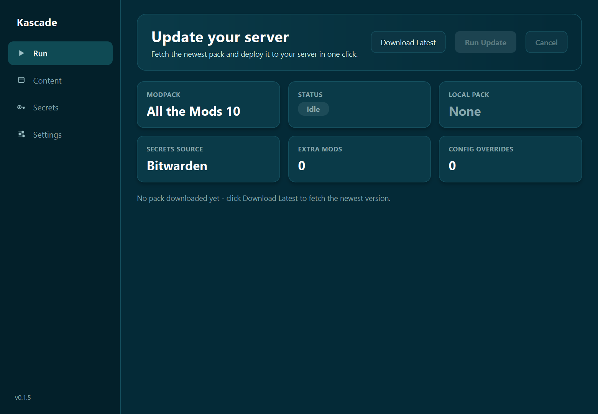
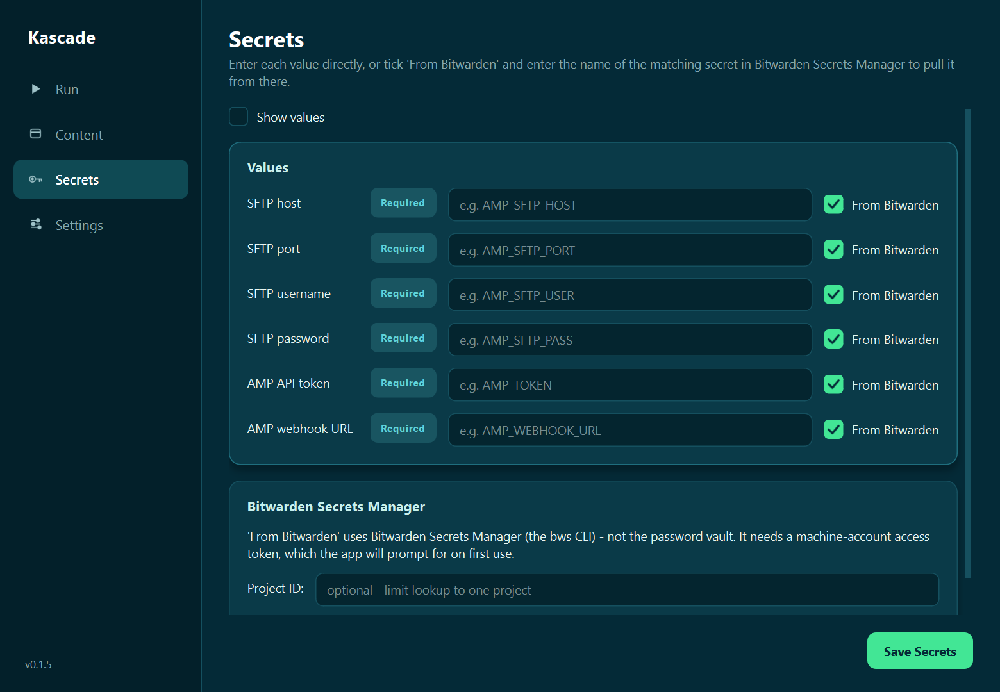
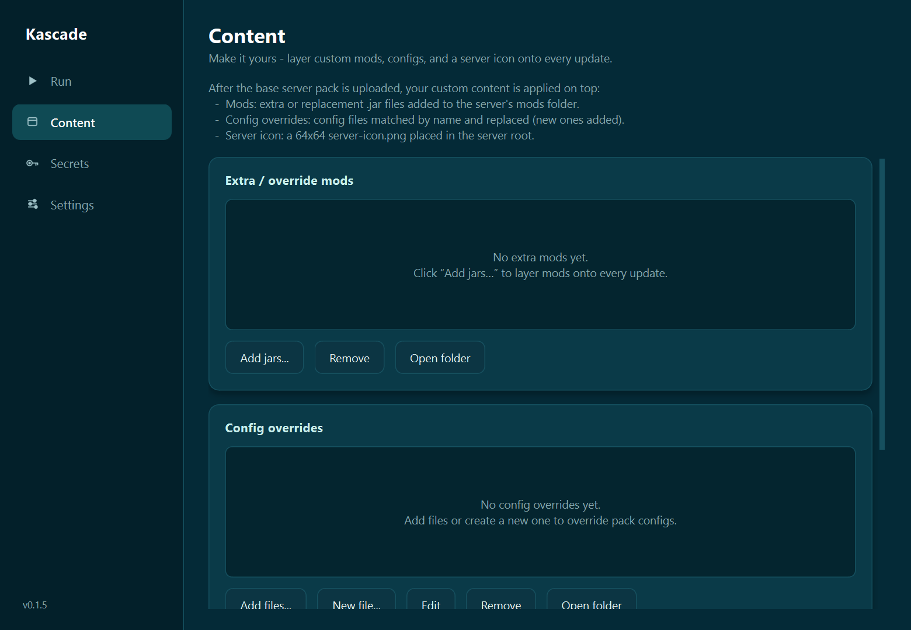
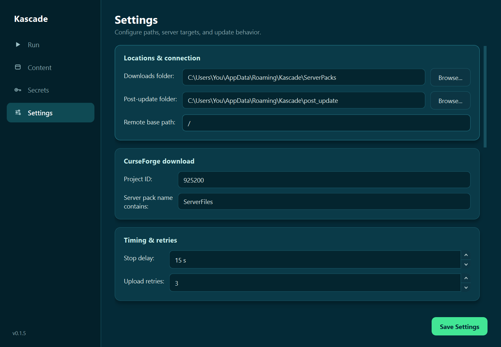
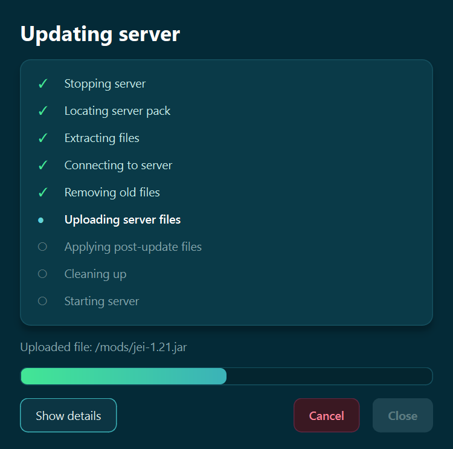

# Kascade

A sleek Windows app that keeps a modded Minecraft server in rhythm with the latest pack release. Kascade downloads the newest CurseForge **server pack**, layers your own mods/configs/server icon on top, and deploys everything to your server over SFTP — stopping and restarting it through an AMP webhook.

Defaults target [All the Mods 10](https://www.curseforge.com/minecraft/modpacks/all-the-mods-10), but the CurseForge project is configurable, so it works for other packs too.

## Features

- **One-click update** — stop server, upload the new pack, apply your overrides, restart.
- **Download Latest** — finds and downloads the newest server pack straight from CurseForge (no API key required), with a confirmation prompt.
- **Content management** — add/edit override mods and config files, and set a custom server icon (any image is auto-resized to Minecraft's required 64×64 PNG).
- **Flexible secrets** — enter values directly, or pull each one from [Bitwarden Secrets Manager](https://bitwarden.com/products/secrets-manager/) by name. The `bws` CLI is downloaded automatically on first use if needed.
- **Live progress** — a modal activity view with per-phase status and an optional detailed log.
- **Self-contained** — creates its own working folders under `%APPDATA%\Kascade` and downloads the `bws` CLI on first use if needed.

## Screenshots

| Run | Secrets |
|:---:|:---:|
|  |  |
| **Content** | **Settings** |
|  |  |

**Live update progress**

<p align="center">
  
</p>

## Requirements

- Windows
- Python 3.x (for running from source or building)
- A Minecraft server managed by [AMP](https://cubecoders.com/AMP) with SFTP access and a webhook configured
  ([webhook setup docs](https://discourse.cubecoders.com/t/webhook-and-stream-deck-integrations/34321))

## Run from source

```
pip install -r requirements.txt
python run_app.py
```

## Build a standalone .exe

```
build_app.bat
```

This produces:

- `dist\Kascade.exe` — a portable single-file executable (PyInstaller).
- `dist\Kascade-Setup.exe` — a per-user installer (no admin required) that adds
  Start Menu / Desktop shortcuts and an uninstaller.

The installer step uses [Inno Setup](https://jrsoftware.org/isdl.php) (install
it, e.g. `winget install JRSoftware.InnoSetup`). If it isn't found, the build
still produces the portable `.exe` and just skips the installer.

Tagged releases are also built automatically by GitHub Actions, which publishes
both the portable `.exe` and the installer.

## Configuration

All settings live in the app (saved to `%APPDATA%\Kascade\config.json`):

- **Secrets** — SFTP host/port/username/password, AMP API token, and webhook URL. Each can be plaintext or pulled from Bitwarden Secrets Manager.
- **Content** — manage override mods, config files, and the server icon.
- **Settings** — folders, target files, timing, retries, and the CurseForge project ID.

## Security

Kascade handles SFTP credentials and an AMP token, so it takes some care with them:

- **Secrets encrypted at rest** — secret values you enter directly, and a
  remembered Bitwarden access token, are encrypted with the Windows Data
  Protection API (DPAPI). They can only be decrypted by the same Windows user on
  the same machine, and a copied `config.json` won't reveal them.
- **SFTP host-key verification** — the server's host key is recorded on first
  connection (trust-on-first-use, in `%APPDATA%\Kascade\known_hosts`). If a known
  server later presents a different key, the update aborts before any
  credentials are sent — protecting against man-in-the-middle interception.
- **Webhook over HTTPS** — the AMP token is only sent over `https://` (plain
  `http://` is allowed only for a local/LAN AMP instance), so the token isn't
  exposed in cleartext on the network.
- **Verified CLI download** — the `bws` CLI is downloaded from its official
  GitHub release and verified against a pinned SHA-256 before it's run.

## Notes

- Bitwarden mode uses the `bws` CLI (Secrets Manager) — not the password vault — and needs a machine-account access token (`BWS_ACCESS_TOKEN`), which the app prompts for and can remember.
